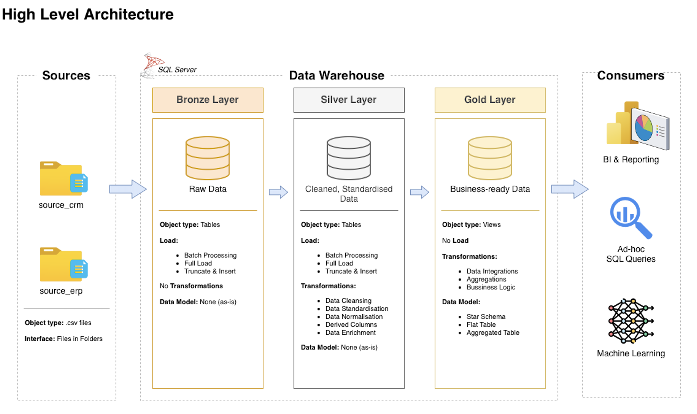
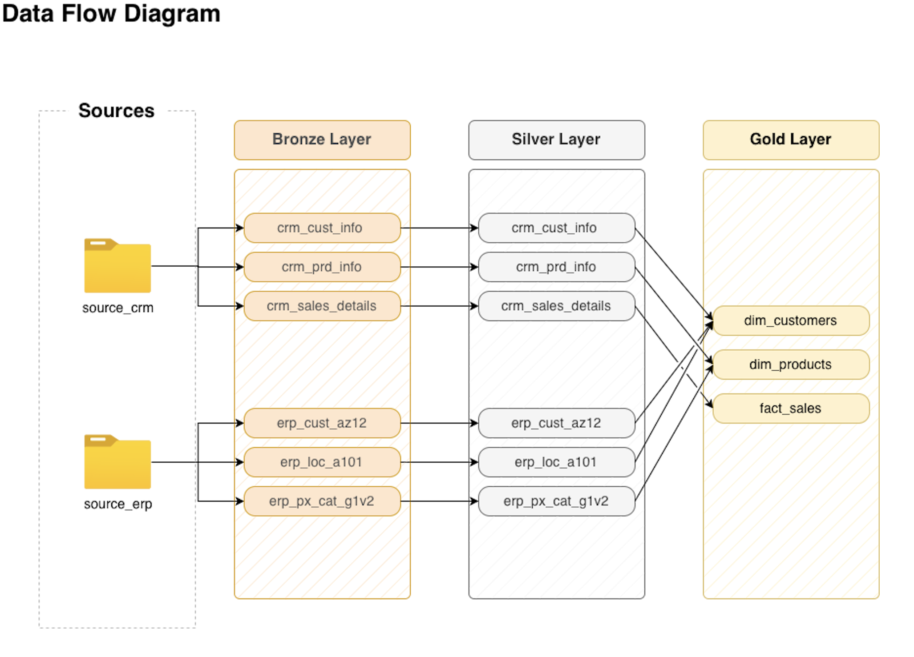
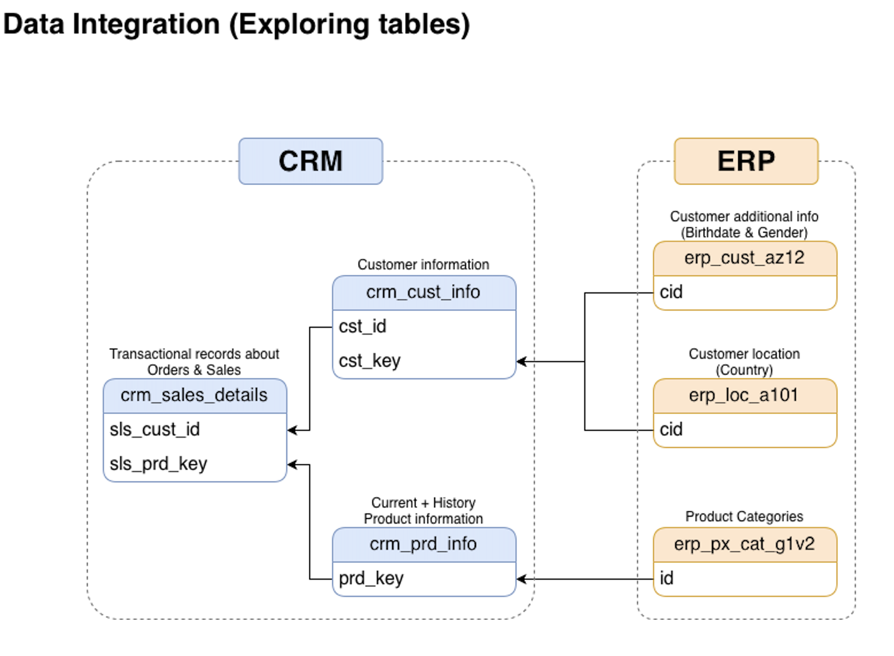
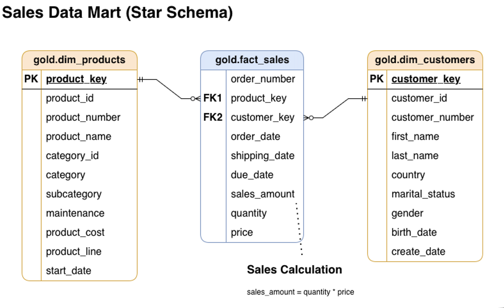

# Data Warehouse and Analytics Project

Welcome to the **Data Warehouse and Analytics Project** repository!
This project demonstrates a comprehensive data warehousing and analytics solution, from building a data warehouse to generating actionable insights. Designed as a portfolio project highlights industry best practices in data engineering and analytics.

---

## 📂 Repository Structure
```
SQL-PRACTICE/
├── Learning/                     # General SQL learning materials, exercises, and notes from SQL course
└── SQL-Data-Warehouse-Project/   # Main data warehouse project
    ├── Diagrams/                 # Architecture diagrams and visual documentation
    ├── Scripts/                  # SQL scripts for data transformations and logic
    ├── Tests/                    # Data quality and validation testing scripts
    └── naming_conventions.md     # Guidelines for database object naming
```
--- 

## Project Requirements

### Building the Data Warehouse (Data Engineering)

#### Objective
Develop a modern data warehouse using SQL Server to consolidate sales data, enabling analytical reporting and informed decision-making.

#### Specifications
- **Data Sources**: Import data from two source systems (ERP and CRM) provided as CSV files.
- **Data Quality**: Cleanse and resolve data quality issues prior to analysis.
- **Integration**: Combine both sources into a single, user-friendly data model designed for analytical queries.
- **Scope**: Focus on the latest dataset only; historization of data is not required.
- **Documentation**: Provide clear documentation of the data model to support both business stakeholders and analytics teams.

---

### BI: Analytics & Reporting (Data Analytics)

#### Objective
Develop SOL-based analytics to deliver detailed insights into:
- **Customer Behavior**
- **Product Performance**
- **Sales Trends**

These insights empower stakeholders with key business metrics, enabling strategic decision-making.

---
##### 1. Define DataWareHouse Architecture, Naming Conventions & Initialize DB

[Database initialization](./SQL-Data-Warehouse-Project/Scripts/init_database.sql)
[Naming conventions](./SQL-Data-Warehouse-Project/naming_conventions.md)

##### 2. Data Flow Diagram, Create & Load BRONZE LAYER

[Bronze Layer](./SQL-Data-Warehouse-Project/Scripts/Bronze/)

##### 3. Analyze Data (Data Integration), Create & Load SILVER LAYER

[Silver Layer](./SQL-Data-Warehouse-Project/Scripts/Silver/)

##### 4. Data Model, Create GOLD LAYER

[Gold Layer](./SQL-Data-Warehouse-Project/Scripts/Gold/)
---

# Data Catalog for Gold Layer

## Overview
The Gold Layer is the business-level data representation, structured to support analytical and reporting use cases. It consists of **dimension tables** and **fact tables** for specific business metrics.

---

### 1. **gold.dim_customers**
- **Purpose:** Stores customer details enriched with demographic and geographic data.
- **Columns:**

| Column Name      | Data Type     | Description                                                                                   |
|------------------|---------------|-----------------------------------------------------------------------------------------------|
| customer_key     | INT           | Surrogate key uniquely identifying each customer record in the dimension table.               |
| customer_id      | INT           | Unique numerical identifier assigned to each customer.                                        |
| customer_number  | NVARCHAR(50)  | Alphanumeric identifier representing the customer, used for tracking and referencing.         |
| first_name       | NVARCHAR(50)  | The customer's first name, as recorded in the system.                                         |
| last_name        | NVARCHAR(50)  | The customer's last name or family name.                                                      |
| country          | NVARCHAR(50)  | The country of residence for the customer (e.g., 'Australia').                                |
| marital_status   | NVARCHAR(50)  | The marital status of the customer (e.g., 'Married', 'Single').                               |
| gender           | NVARCHAR(50)  | The gender of the customer (e.g., 'Male', 'Female', 'Unknown').                               |
| birthdate        | DATE          | The date of birth of the customer, formatted as YYYY-MM-DD (e.g., 1971-10-06).                |
| create_date      | DATE          | The date and time when the customer record was created in the system|

---

### 2. **gold.dim_products**
- **Purpose:** Provides information about the products and their attributes.
- **Columns:**

| Column Name         | Data Type     | Description                                                                                   |
|---------------------|---------------|-----------------------------------------------------------------------------------------------|
| product_key         | INT           | Surrogate key uniquely identifying each product record in the product dimension table.        |
| product_id          | INT           | A unique identifier assigned to the product for internal tracking and referencing.            |
| product_number      | NVARCHAR(50)  | A structured alphanumeric code representing the product, often used for categorization or inventory. |
| product_name        | NVARCHAR(50)  | Descriptive name of the product, including key details such as type, color, and size.         |
| category_id         | NVARCHAR(50)  | A unique identifier for the product's category, linking to its high-level classification.     |
| category            | NVARCHAR(50)  | The broader classification of the product (e.g., Bikes, Components) to group related items.   |
| subcategory         | NVARCHAR(50)  | A more detailed classification of the product within the category, such as product type.      |
| maintenance         | NVARCHAR(10)  | Indicates whether the product requires maintenance (e.g., 'Yes', 'No').                       |
| cost                | INT           | The cost or base price of the product, measured in monetary units.                            |
| product_line        | NVARCHAR(10)  | The specific product line or series to which the product belongs (e.g., Road, Mountain).      |
| start_date          | DATE          | The date when the product became available for sale or use, stored in|

---

### 3. **gold.fact_sales**
- **Purpose:** Stores transactional sales data for analytical purposes.
- **Columns:**

| Column Name     | Data Type     | Description                                                                                   |
|-----------------|---------------|-----------------------------------------------------------------------------------------------|
| order_number    | NVARCHAR(50)  | A unique alphanumeric identifier for each sales order (e.g., 'SO54496').                      |
| product_key     | INT           | Surrogate key linking the order to the product dimension table.                               |
| customer_key    | INT           | Surrogate key linking the order to the customer dimension table.                              |
| order_date      | DATE          | The date when the order was placed.                                                           |
| shipping_date   | DATE          | The date when the order was shipped to the customer.                                          |
| due_date        | DATE          | The date when the order payment was due.                                                      |
| sales_amount    | INT           | The total monetary value of the sale for the line item, in whole currency units (e.g., 25).   |
| quantity        | INT           | The number of units of the product ordered for the line item (e.g., 1).                       |
| price           | INT           | The price per unit of the product for the line item, in whole currency units (e.g., 25).      |

---

## 🌟 About Me

Hi there! I'm **Daria Yakovenko**, a **Master's student in Robotics Systems** at Igor Sikorsky Kyiv Polytechnic Institute.

Want to collaborate on a project or just say hi? Let's connect:

[](https://www.linkedin.com/in/daria-yakovenko-9580b0248/)
